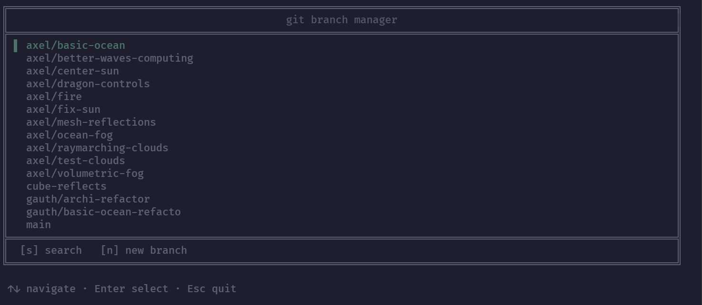

# Git Branch Switcher CLI

A very simple **CLI tool** for Git repositories that lets you switch between branches using an interactive interface.

<p align="center">
  
</p>

## Installation

1. Clone the repository:

```bash
git clone https://github.com/Axthauvin/gbs
```

2. Run the installation script:

```bash
cd gbs
chmod +x install.sh
./install.sh
```

3. The command is now available globally:

```bash
gbs
```

You can safely delete the cloned repository afterward.

## Usage

Inside any Git repository:

```bash
gbs
```

Select a branch from the interactive menu and press **Enter** to switch to it.

## Local Development

Compile the project:

```bash
make
```

Run it locally:

```bash
./gbs
```

## TODO

* [x] Search branches by typing their name
* [ ] Interactive menu to create a new branch
